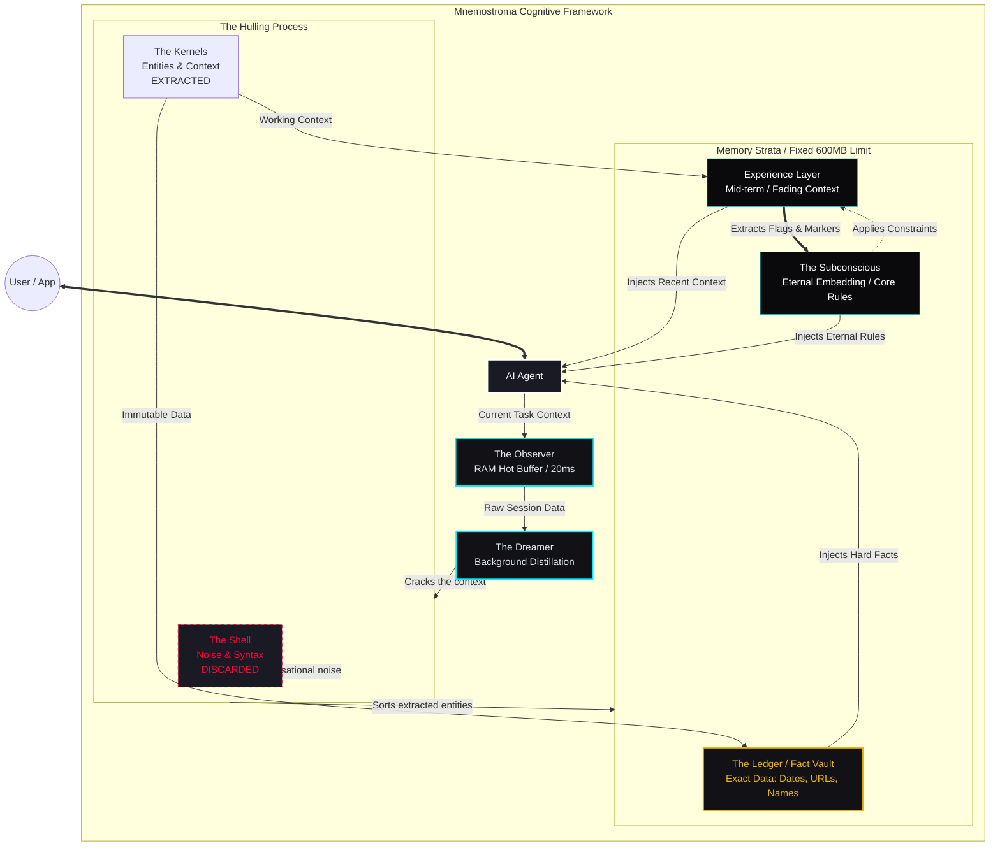

# Mnemostroma

### The memory layer for AI agents


> *μνήμη (mnḗmē, memory) + στρῶμα (strôma, layer) — the substrate everything rests on.*

> **v2.3.0 is stable.** Upgrading from v1.9.1 or earlier? → [See UPGRADE.md](./UPGRADE.md)

---

You open a new chat. Explain everything again.
The model has no idea what you decided last week.
What's blocked. What's off the table. What matters.

You're not talking to an agent. You're talking to a goldfish with a PhD.

**Mnemostroma fixes that.**

It sits between you and your AI — silent, invisible, always on.
You keep working. Mnemostroma watches, learns, remembers.

Next session? Your agent already knows the context.
No prompting tricks. No pasting logs. No "as I mentioned before."

---

## What it does

Every time you work with an AI agent, Mnemostroma:

- **Catches what matters** — decisions, constraints, key facts — automatically
- **Compresses it smartly** — not a transcript, a distilled memory
- **Surfaces it when relevant** — without you asking
- **Forgets gracefully** — old stuff fades, critical stuff stays forever
- **Works offline** — your memory, your machine, no cloud

---

A dual-stream async pipeline (Observer + Content) backed by 5 memory layers and
a Formal Hexagonal Architecture — strictly decoupled via Ports and Repository Adapters
(SessionRepo, PrecisionRepo) over SQLite WAL. All in ~420MB RAM (baseline) / ~650MB (zoo), ~20ms retrieval.

---

## How it works

```
Your Agent
    │
    ├── OBSERVER (async sidecar — writes)
    │     Watches all I/O, extracts entities, embeds, scores, indexes
    │     Agent never writes memory — Observer does it silently
    │
    ├── AGENT TOOLS (read-only, via MCP)
    │     ctx_semantic()  → find by meaning          ~20ms
    │     ctx_anchors()   → decisions, deadlines    <0.1ms
    │     ctx_search()    → find by tags            <0.1ms
    │     ctx_bridge()    → session handoff packet  <0.01ms
    │
    └── CONTENT BRANCH (versioned artifacts)
          Code, chapters, configs — with diffs and why_changed
```

**The agent never writes memory.** It only reads and acts. Observer handles everything else.

---

### Architecture Diagram



---

**Example — memory retrieval in action:**

```
You:   "What did we decide about the auth flow last week?"
Agent: (silently calls ctx_semantic("auth flow decision"))
       "We decided to use short-lived JWT tokens with refresh via
        Redis — no sessions on the server side."
```

No prompting tricks. No copy-pasting logs. The agent just knows.
**Core product is RAM-only by default** for speed. Reliability is guaranteed by a formal `PersistenceLayer` (Phase 9.2), which manages asynchronous SQLite WAL writes and provides a strict isolation boundary between memory logic and storage.

---

## Memory model

Mnemostroma doesn't archive — it **dissolves**.

```
Day 1:    Full detail — brief, anchors, precision data, embedding
Week:     Detail fades — precision moves to SQLite
Month:    Brief + tags + anchors remain
Year:     Brief + embedding only
Decade:   Embedding only — the shape of memory without content
```

What you use stays vivid. What you don't fades gradually.
Principles never dissolve. Decisions persist. Phone numbers expire.

This is not a database with TTL. This is how human memory works.

---

## Status

**Current:** v2.3.0 | 2026-05-30

| Component | Status |
|---|---|
| Core backend — Observer, Memory, Storage | ✅ DONE — 831 tests |
| Golden Standard Launch (Shell Guards) | ✅ DONE — v1.11.1 |
| Anchor Layer / Emotional Patterns | ✅ DONE |
| Implicit Feedback (v1.5) | ✅ DONE |
| PersistenceLayer Split (Phase 9.2) | ✅ DONE — v1.7.1 |
| CLI User Mode (setup/on/off/status) | ✅ DONE — v1.7.1 |
| MCP Server (stdio + SSE) | ✅ DONE |
| Continuation Detection & Mention Type | ✅ DONE |
| Decay Engine & Dreamer | ✅ DONE — Stage C/D |
| Passthrough HTTPS Proxy (:8767) | ✅ DONE — v1.7.5 |
| `mnemo` launcher with proxy failsafe | ✅ DONE — v1.7.5 |
| Model install CLI | ✅ DONE |
| **Daemon auto-start scripts** | ✅ DONE — Linux (systemd), macOS, Win |
| **Hexagonal Storage Refactor** | ✅ DONE — v1.8.0 |
| **Browser Extension v1.0.5** | ✅ DONE — v2.2.7, ES modules, 6 adapters |
| **Remote MCP Tunnel — Cloudflare + OAuth** | ✅ DONE — v2.3.0 |
| **Tunnel UI Controls — Tray menu + Extension ring** | ✅ DONE |
| **Tunnel Headless Launch — Path resolution, PID restore, atomic state** | ✅ DONE |
| **Windows 10/11 Compatibility — Task Scheduler, DPI, tooltip** | ✅ DONE |

---

## Installation

**Requires Python 3.12+**

> **v2.3.0 is stable.** Upgrading from v1.9.1 or earlier? → [See UPGRADE.md](./UPGRADE.md)

---

### Option A — Automatic (Recommended for Linux)

One command to rule them all. Creates venv, installs everything (including tray/sse), and configures systemd:

```bash
bash <(curl -fsSL https://raw.githubusercontent.com/GG-QandV/mnemostroma/main/scripts/install-daemon.sh)
```

---

### Option B — pipx (Ubuntu / Debian / Fedora)

Isolated install for PEP 668 systems. Recommended for most users:

```bash
# Install pipx if missing
sudo apt update && sudo apt install -y pipx python3-gi gir1.2-appindicator3-0.1
pipx ensurepath

# Install Mnemostroma with ALL features (tray, sse, watch)
pipx install "git+https://github.com/GG-QandV/mnemostroma.git[all]"

# Setup environment (models, certs)
mnemostroma setup
```

---

### Option C — macOS / Windows

**macOS:**

```bash
pip install "git+https://github.com/GG-QandV/mnemostroma.git[all]"
mnemostroma setup
```

**Windows — установка:**

> ⚠️ **Сначала установите Git** — он нужен для скачивания Mnemostroma.
>
> 👉 **[Скачать Git для Windows](https://git-scm.com/download/win)** — установите с настройками по умолчанию.
>
> Python устанавливается автоматически во время установки Mnemostroma.

**Шаг 1.** Скачайте файл установщика:

👉 **[Скачать install-windows.bat](https://raw.githubusercontent.com/GG-QandV/mnemostroma/main/scripts/install-windows.bat)**

*(правая кнопка мыши → «Сохранить ссылку как» → Рабочий стол или папка Загрузки)*

**Шаг 2.** Дважды кликните на `install-windows.bat`.

Появится чёрное окно — это нормально. Установщик автоматически:
- проверит и установит Python, если нужно
- скачает Mnemostroma (~300 МБ моделей AI)
- настроит автозапуск при входе в Windows

**Шаг 3.** Дождитесь сообщения `Done. You can close this window.` и закройте окно.

> 💡 Если Windows показывает «Неизвестный издатель» — нажмите **«Подробнее» → «Выполнить в любом случае»**.
> На семейном ПК — запустите установщик под каждой учётной записью отдельно.


**Что создаётся после установки:**

| Файл | Назначение |
|---|---|
| `%USERPROFILE%\.mnemostroma\install.log` | Полный лог установки для диагностики |
| `%USERPROFILE%\.mnemostroma\install-manifest.json` | Манифест установки (используется при удалении) |
| `%USERPROFILE%\.mnemostroma\daemon.log` | Лог работы демона |

> 🤖 **Если что-то пошло не так:** откройте `install.log` из папки `%USERPROFILE%\.mnemostroma\`,
> скопируйте содержимое и вставьте в [ChatGPT](https://chat.openai.com), [Claude](https://claude.ai) или [Gemini](https://gemini.google.com) с вопросом «что здесь пошло не так?».

**Удаление:**

👉 **[Скачать uninstall-windows.bat](https://raw.githubusercontent.com/GG-QandV/mnemostroma/main/scripts/uninstall-windows.bat)**

Двойной клик — удалит задачи автозапуска, PATH и venv. Данные памяти спросит отдельно.

<details>
<summary>Ручная установка (для опытных пользователей)</summary>

```powershell
py -3.12 -m venv "$env:USERPROFILE\.mnemostroma\venv"
& "$env:USERPROFILE\.mnemostroma\venv\Scripts\pip" install "git+https://github.com/GG-QandV/mnemostroma.git[all]"
mnemostroma setup
mnemostroma service install
mnemostroma on
```
</details>

---


### Installation Extras

| Extra    | Installs         | Requirement                      |
| -------- | ---------------- | -------------------------------- |
| `[all]`  | **Everything**   | Recommended for full UX          |
| `[tray]` | System tray icon | Requires `PyQt6` + system libs   |
| `[sse]`  | HTTPS/SSE proxy  | Requires `uvicorn` + `starlette` |

> [!IMPORTANT]
> **Linux Tray Dependencies:**
> Native tray support requires: `sudo apt install python3-gi gir1.2-appindicator3-0.1`.
> Without these, the `tray` command will fall back to PyQt6 or provide an error message.

---

### Quick Start

1. **Install** via one of the options above.
2. **Setup**: Run `mnemostroma setup`. This downloads ~300 MB of models.
3. **Start**: `mnemostroma on`
4. **Dashboard**: `mnemostroma tray` (or `mnemostroma watch` for terminal)

---

### Troubleshooting

**`error: externally-managed-environment`**
Use **Option A** or **Option B**. Do not use `pip install` on modern Ubuntu/Debian.

**`tray` command fails**
Ensure you installed with `[all]` or `[tray]`. On Linux, verify `python3-gi` is installed.

**`mnemostroma: command not found`**
Ensure your PATH is updated (run `pipx ensurepath` or `source ~/.bashrc`).

**Windows-specific errors:**

| Error | Cause | Fix |
|---|---|---|
| `pip is not recognized` | Python not in PATH | Reinstall Python with "Add to PATH" checked |
| `mnemostroma is not recognized` | `Scripts\` not in PATH | Close and reopen PowerShell |
| `git is not recognized` | Git not installed | Install from [git-scm.com](https://git-scm.com) |
| `Register-ScheduledTask` error | Group Policy restriction | Run PowerShell as Administrator |

---

## Quick Start

```bash
mnemostroma setup        # Create ~/.mnemostroma/, download models (~300 MB), generate TLS cert + mnemo launcher
mnemostroma on           # Start daemon in background
mnemostroma status       # Check health, RAM usage, session count
mnemostroma off          # Stop daemon
```

**With passthrough proxy (captures Claude Code sessions into memory):**

```bash
mnemostroma sse          # Start SSE adapter + proxy on :8767
mnemo                    # Launch Claude Code through the proxy (falls back to direct if proxy is down)
```

## Updating

To update Mnemostroma to the latest version (including dependencies and services):

```bash
bash scripts/update.sh
```

This script handles:
- Gracefully shutting down all background services and killing zombie processes
- Git pulling the latest changes
- Syncing and unpacking the browser extension
- Dependency synchronization via `uv` (or `pip`)
- Service restoration and startup (including the Tunnel and UI)

---

**Register as autostart service:**

| OS      | Command                       | Backend             |
| ------- | ----------------------------- | ------------------- |
| Linux   | `mnemostroma service install` | systemd user unit   |
| macOS   | `mnemostroma service install` | launchd LaunchAgent |
| Windows | `mnemostroma service install` | Task Scheduler      |

> **Windows note:** Signals `SIGUSR1/2` (flush/dump) are unavailable on Windows. Use `mnemostroma off` and `mnemostroma on` instead. For the best experience, WSL2 (Ubuntu) is recommended.

**Management commands:**

```bash
mnemostroma config list       # View all 80+ tunable parameters
mnemostroma logs --days 7     # Memory growth and calibration report
mnemostroma watch             # Live terminal dashboard
mnemostroma tray              # System tray indicator (requires [tray] extra)
```

**Emergency Operations (Crash/Zombie cleanup):**
If Mnemostroma terminals hang, multiple daemon instances collide, or RAM refuses to release after a bad upgrade/crash:

- **Via CLI:** Run `python3 scripts/clean-zombies.py` in the project root. It auto-locates your `venv`, gracefully stops systemd services, and aggressively hunts and kills all lingering processes from RAM without affecting your databases.
- **Via Tray:** Select **"Hard RAM Reset (Emergency)"** from the Mnemostroma Tray menu to execute this silently.

> **Note:** if `tray` command is missing or fails, ensure you installed the extra:
> `pip install "mnemostroma[tray]"`

> **Next step:** Set up daemon auto-start on your OS ([Linux](./scripts/linux/README.md) | [macOS](./scripts/macos/README.md) | [Windows](./scripts/windows/README.md)) — see [Daemon Installation Guide →](./scripts/README.md)

---

## Model Setup

Downloaded automatically during `mnemostroma setup` (~300 MB total):

| Model                        | Size    | Role                                |
| ---------------------------- | ------- | ----------------------------------- |
| `multilingual-e5-small` INT8 | ~117 MB | Session + content embedder (384d)   |
| `distilbert-ner` INT8        | ~60 MB  | Named entity recognition            |
| `tinybert-l2-v2` INT8        | ~7 MB   | Cross-encoder reranking (lazy load) |

---

## Stack

No torch. No transformers. No LangChain. No Docker. No Redis. No cloud.

| Component                  | Disk                               | Role                              |
| -------------------------- | ---------------------------------- | --------------------------------- |
| multilingual-e5-small INT8 | ~117 MB                            | Session & content embedder (384d) |
| distilbert-ner INT8        | ~60 MB                             | HybridNER                         |
| TinyBERT-L-2-v2 INT8       | ~7 MB                              | Reranker (lazy)                   |
| **Total working set**      | **~300 MB disk · ~420-650 MB RAM** |                                   |

Core dependencies: `onnxruntime, tokenizers, numpy, lz4, aiosqlite`

---

##  API surface (11 tools via MCP)

**Recollection (7):**

- `ctx_full(id)`: Full-text version from SQLite (for exact quoting)
- `ctx_anchors(type)`: Subconscious anchors (decisions, facts, deadlines)
- `ctx_precision(type)`: Exact data (links, formulas, quotes)
- `ctx_bridge()`: Structured context handoff packet for next agent
- `content_search(query)`: Semantic search over artifacts (code, docs)
- `content_raw(id, version)`: Full source retrieval (expensive)
- `content_history(id)`: Version lineage and change log

**Navigation (4):**

- `ctx_semantic(query)`: Meaning-based search (MatrixSearch ANN, ~20ms)
- `ctx_get(id)`: Retrieve specific session by ID
- `ctx_search(tags)`: Tag-based search (precise, multi-language)
- `ctx_recent(n)`: Temporally ordered recent sessions (Repo-backed)

> [!NOTE]
> `ctx_active` is removed — current context is injected via `<memorycontext>` in the system prompt automatically. `ctx_urgent` is merged into `ctx_anchors(type="deadline")`. `ctx_load` is daemon-internal only.

**Observer Principle:** You never call "save_memory". The Observer watches your conversation and handles everything in the background. Tools are for *reading* memory, not writing it.


---

##  Browser Integration (Mnemostroma Extension)


Mnemostroma includes a lightweight, secure browser extension that allows you to seamlessly feed chat contexts from leading LLM interfaces into your local memory layer.

> [!IMPORTANT]
> **Архитектурный принцип интеграции с публичными веб-чатами (Claude.ai, ChatGPT.com и др.):**
> * **Веб-версии чатов НЕ поддерживают MCP-протокол напрямую** из-за ограничений безопасности песочницы браузера (Sandbox). Они не могут выполнять локальные команды stdio или открывать прямые SSE-соединения с вашей системой.
> * По этой причине взаимодействие разделено согласно фундаментальному инварианту Мнемостромы:
>   1. **Запись памяти (Браузер → Мнемострома)**: Браузерное расширение Mnemostroma выступает в роли **«тихого наблюдателя» (Silent Observer)**. Оно работает в фоне, автоматически перехватывает ваши сообщения и ответы ИИ на поддерживаемых сайтах и отправляет их в локальную базу данных Мнемостромы через внутренний WebSocket-сервер демона (`127.0.0.1:8766`).
>   2. **Чтение памяти (Мнемострома → Агенты в IDE/CLI)**: Чтение накопленного контекста памяти выполняется вашим локальным ИИ-ассистентом (Cursor, VS Code, Claude Desktop, Claude Code), которые подключаются к демону Мнемостромы по стандартному протоколу MCP.
>
> Таким образом, для работы с веб-чатами вам **не нужно настраивать MCP в браузере**. Достаточно установить расширение, и память начнет накапливаться автоматически!

### Supported Chat Interfaces:
- **Claude** (`claude.ai`)
- **ChatGPT** (`chatgpt.com`)
- **Gemini** (`gemini.google.com`)
- **DeepSeek** (`chat.deepseek.com`)
- **Perplexity** (`perplexity.ai`)
- **Grok** (`x.ai` / `grok.com`)

###  Quick Extension Installation:

For a detailed step-by-step guide with platform-specific instructions, see the dedicated [Browser Extension Installation Guide](./src/extension/docs/INSTALL.md#1-простая-установка-рекомендуется).

1. **Prepare Extension Files**:
   - **Simple Path (Recommended)**: Run `mnemostroma setup` (or use the Windows Clients Installer) to automatically extract the compiled extension to `~/.mnemostroma/extension`. **No Git or download required.**
   - **Developer Path**: Clone this repository and use the `src/extension` directory directly.
2. Open your browser extension settings page (e.g. `chrome://extensions/` in Chrome or Edge, or `about:debugging` in Firefox).
3. Enable **"Developer mode"** in the top right.
4. Click **"Load unpacked"** (or "Load Temporary Add-on" in Firefox) and select the extension directory:
   - For **Simple Path**: Choose `~/.mnemostroma/extension` (Linux/macOS) or `%USERPROFILE%\.mnemostroma\extension` (Windows).
   - For **Developer Path**: Choose `src/extension` inside your Mnemostroma repository.
5. The extension will automatically connect to your local Mnemostroma daemon (`http://127.0.0.1:8766`).

###  Action Icon & Badge Indicators:
The Mnemostroma icon in your extension bar is fully functional and uses colors + text badges to show real-time connectivity status:

- **Active (Green badge / Clean)**: Everything is perfect. The local daemon is active, global capture is enabled, and the last memory stream POST request was successful.
- **Warning (Yellow badge / `!` marker)**: Warning status. The daemon is running, but either global memory capture is paused in the popup menu, the current site is disabled, or the last POST request failed.
- **Offline (Red badge / `X` marker)**: Offline. The extension cannot connect to the Mnemostroma daemon. Make sure the daemon is running (`mnemostroma start` or universal script).

### Tunnel Ring Indicator
A circular ring around the extension icon shows tunnel status independently:

- **Green ring** — Tunnel active. URL has been received and cloudflared is running. Memory tools are available to web chats.
- **Yellow pulsing ring** — Tunnel starting. cloudflared process is alive but URL not yet received (transient state during launch).
- **No ring** — Tunnel off. No tunnel process and no URL.

The ring updates every ~3s via `observeFetch()` with dual-port fallback (8769 → 8766, 1500ms timeout). Click the tunnel status text in the popup to start/stop the tunnel directly from the extension.

---

##  Connecting to LLM (MCP)

The daemon must be running before any client connects.

**Choose your OS for detailed configuration:**

- [Linux (systemd)](./scripts/linux/README.md)
- [macOS (launchd)](./scripts/macos/README.md)
- [Windows (Task Scheduler)](./scripts/windows/README.md)

### Installation & Deployment

The easiest way to install Mnemostroma is to use the universal installer script. It automatically detects your OS, sets up a virtual environment, and registers background services.

```bash
bash scripts/install-daemon.sh
```

#### Linux (systemd)

The installer sets up **five** systemd user units:

- `mnemostroma-daemon.service` — Main daemon: Observer, Memory, Storage
- `mnemostroma-proxy.service` — HTTPS proxy + SSE Adapter (Claude Code)
- `mnemostroma-watchdog.service` — Automated health monitor and recovery
- `mnemostroma-ui.service` — System tray status icon
- `mnemostroma-tunnel.service` — Cloudflare Tunnel + MCP OAuth Adapter

**Quick Commands (Linux):**

```bash
mnemostroma status   # View status of all services
mnemo-logs           # Tail daemon logs
mnemo-restart        # Full stack restart
```

#### macOS (launchd)

Installs the main daemon as a `LaunchAgent`.

- `com.mnemostroma.daemon.plist` — Background daemon process

**Quick Commands (macOS):**

```bash
launchctl start com.mnemostroma.daemon
launchctl stop com.mnemostroma.daemon
tail -f ~/.mnemostroma/daemon.log
```

#### Windows (Task Scheduler)

Registers three persistent tasks in Windows Task Scheduler (Daemon, Proxy, Watchdog). No administrator rights required.

```powershell
Invoke-WebRequest -Uri "https://raw.githubusercontent.com/GG-QandV/mnemostroma/main/scripts/install-windows.ps1" -OutFile "$env:TEMP\mnemo-install.ps1"
powershell -ExecutionPolicy Bypass -File "$env:TEMP\mnemo-install.ps1"
```

> **Architecture note:** Clients (VS Code, Claude Code, Cursor) will spawn lightweight adapter processes (~70 MB) that connect to this daemon via socket. The daemon persists to maintain cross-session memory; adapters are ephemeral.

### Claude.ai (Web Interface) — Custom MCP Connector (Beta)

Claude.ai supports connecting custom remote MCP servers. While Server-Sent Events (SSE) was the legacy transport, **Streamable HTTP** is the current, modern standard as of the latest MCP specifications. Mnemostroma fully supports both transports.

To connect Mnemostroma as a Custom Connector in **Claude.ai → Settings → Integrations → Add Custom Connector** (or via `https://claude.ai/customize/connectors?modal=add-custom-connector`):

1. **Start the appropriate adapter** in a separate terminal:
   * **Streamable HTTP (Recommended, port 8768):** Started by default with the daemon. Or run manually: `python3 -m mnemostroma.integration.mcp_http_adapter`
   * **SSE (Legacy, port 8765):** Run manually: `mnemostroma sse` (requires `pip install mnemostroma[sse]`)
2. **Expose the local port** to the internet via Cloudflare Tunnel (recommended) or a similar secure tunneling service (e.g. Serveo), since Claude's servers require a publicly accessible HTTPS URL.
3. **Fill the Add Custom Connector form** in Claude.ai with the following values:

#### Option A: Streamable HTTP (Recommended)
| Field | Value | Description |
|---|---|---|
| **Type / Transport** | `HTTP` or `Streamable HTTP` | Choose the modern HTTP transport |
| **Name** | `mnemostroma` | Any identifier for the connector |
| **Target URL** | `https://mnemo.yourdomain.com/mcp` | Public HTTPS endpoint pointing to port `8768` (path `/mcp`) |
| **Authorization Header** | `Bearer <your-token>` | Retrieve your secure token: `cat ~/.mnemostroma/sse_token` |
| **OAuth Settings** | *Leave blank (optional)* | Not required for local deployment |

#### Option B: SSE (Legacy)
| Field | Value | Description |
|---|---|---|
| **Type / Transport** | `SSE` | Choose the Server-Sent Events transport |
| **Name** | `mnemostroma` | Any identifier for the connector |
| **Target URL** | `https://mnemo.yourdomain.com/sse` | Public HTTPS endpoint pointing to port `8765` (path `/sse`) |
| **Authorization Header** | `Bearer <your-token>` | Retrieve your secure token: `cat ~/.mnemostroma/sse_token` |
| **OAuth Settings** | *Leave blank (optional)* | Not required for local deployment |

> For a complete, step-by-step walkthrough of setting up Cloudflare Tunnels, generating tokens, and testing your endpoint, see the dedicated [Claude.ai Setup Guide](./docs/CLAUDE_AI_SETUP.md).

---

##  Remote MCP — Web Chat Integration

Connect Mnemostroma to **Claude.ai**, **ChatGPT**, **Perplexity**, and **Grok**
directly in the browser — no extension needed, no manual tunnel setup.

> **How it works in plain language:**
> Your Mnemostroma runs on your computer. Web chats (Claude.ai, ChatGPT etc.)
> live on remote servers and can't reach `localhost`. The tunnel creates a
> temporary secure public URL that points to your machine — the chat connects
> to that URL, talks to Mnemostroma, and you get memory in your web browser
> just like in Claude Code or VS Code.

### Quick Start (3 steps)

**Step 1.** Make sure the daemon is running:
```bash
mnemostroma on
mnemostroma status   # daemon RUNNING ✓
```

**Step 2.** Start the tunnel:
```bash
mnemostroma tunnel start
```

On first run, `cloudflared` (~35 MB) is downloaded automatically. You will see:

```
  Downloading cloudflared...          ✓
  Starting OAuth adapter :8769...     ✓
  Starting Cloudflare tunnel...       ✓

  ┌──────────────────────────────────────────────────────────┐
  │  Your MCP URL:  https://abc123.trycloudflare.com         │
  │  Bearer token:  cat ~/.mnemostroma/tunnel_token          │
  └──────────────────────────────────────────────────────────┘
```

**Step 3.** Paste the URL into your chat:

| Chat | Where to paste | Auth |
|---|---|---|
| **Perplexity** | Settings → AI Plugins → MCP URL | None — just paste URL |
| **Claude.ai** | Settings → Integrations → Add Custom Connector | OAuth — happens automatically in browser |
| **ChatGPT** | Settings → Connectors → Add | OAuth — happens automatically in browser |
| **Grok** | Settings → MCP → Server URL + Bearer token | Paste URL + token from `cat ~/.mnemostroma/tunnel_token` |

> **Note:** The public URL changes every time you restart the tunnel (free Cloudflare plan).
> For a permanent URL, see [Permanent Tunnel Setup](docs/TUNNEL_SETUP.md#permanent-url).

### Register as autostart service

```bash
mnemostroma service install --component tunnel
```

| OS | Backend |
|---|---|
| Linux | systemd user unit `mnemostroma-tunnel.service` |
| macOS | launchd LaunchAgent `com.mnemostroma.tunnel.plist` |
| Windows | Task Scheduler `MnemostromaTunnel` |

### Tunnel CLI reference

```bash
mnemostroma tunnel start     # Start tunnel + adapter (foreground, Ctrl+C to stop)
mnemostroma tunnel stop      # Stop background tunnel service
mnemostroma tunnel status    # Show public URL and token
```

### Tray Tunnel Controls

When running `mnemostroma tray`, the system tray icon includes a **Tunnel** submenu:

| Menu item | Action |
|---|---|
| **Tunnel: Active / Starting… / Off** | Status line (not clickable, auto-updates every 5s) |
| **▶ Start Tunnel** | Start cloudflared + OAuth adapter (disabled when already active) |
| **■ Stop Tunnel** | Gracefully stop the tunnel |
| **↺ Restart Tunnel** | Force kill → 1.5s pause → restart (no dialogs) |
| **✕ Force Kill (Emergency)** | Kill cloudflared via `taskkill /F` (Windows) or `SIGKILL` (Linux/macOS) |

The tunnel state is read from `~/.mnemostroma/tunnel_url` and `~/.mnemostroma/cloudflared.pid` — no IPC needed. The tray checks these files every 5s and updates the menu accordingly.

### Security notes

- The tunnel uses a dedicated `~/.mnemostroma/tunnel_token` — isolated from
  your local `ssetoken`. Revoking tunnel access doesn't affect local IDE connections.
- All traffic between the chat and Mnemostroma is encrypted via Cloudflare HTTPS.
- Claude.ai and ChatGPT use full OAuth 2.0 with PKCE — no manual token copy-paste needed.
- Your conversation content is never stored by Cloudflare — only the MCP protocol
  messages (tool calls and results) pass through the tunnel.

---

### Claude Desktop

**`claude_desktop_config.json`** — same config on all platforms:

```json
{
  "mcpServers": {
    "mnemostroma": {
      "command": "mnemostroma",
      "args": ["mcp"]
    }
  }
}
```

> **Windows:** If `mnemostroma` is not in PATH, use the full path:
> `C:\Users\<YourName>\AppData\Local\Programs\Python\Python312\Scripts\mnemostroma.exe`

Config file locations:

- **Linux/macOS:** `~/.config/Claude/claude_desktop_config.json`
- **Windows:** `%APPDATA%\Claude\claude_desktop_config.json`

---

### Claude Code (CLI)

Claude Code uses the stdio adapter. Run `mnemostroma setup` first — it prints the ready-to-paste config.

**`~/.claude.json`** — `mcpServers` block:

**Linux / macOS:**

```json
{
  "mcpServers": {
    "mnemostroma": {
      "command": "/home/<yourname>/.local/bin/mnemostroma",
      "args": ["mcp"]
    }
  }
}
```

**Windows (PowerShell):**

```json
{
  "mcpServers": {
    "mnemostroma": {
      "command": "C:\\Users\\<YourName>\\AppData\\Local\\Programs\\Python\\Python312\\Scripts\\mnemostroma.exe",
      "args": ["mcp"]
    }
  }
}
```

> Find the correct path: `where mnemostroma` (Windows) / `which mnemostroma` (Linux/macOS)

---

### Claude Code — Passthrough Proxy (Observer for CLI sessions)

To capture Claude Code conversations into memory, run the SSE adapter with the passthrough proxy.
Requires `mnemostroma[sse]` and `mnemostroma setup` (generates TLS cert + wrapper script).

**Step 1 — Setup (once):**

```bash
pip install "mnemostroma[sse]"
mnemostroma setup   # generates TLS cert + ~/.local/bin/mnemo wrapper
```

**Step 2 — Start SSE adapter (includes proxy on :8767):**

```bash
mnemostroma sse
```

**Step 3 — Launch Claude Code via wrapper:**

**Linux / macOS:**

```bash
mnemo           # instead of 'claude' — sets proxy env vars automatically
```

> `mnemo` is a wrapper script placed in `~/.local/bin/` by `mnemostroma setup`.
> It sets `ANTHROPIC_BASE_URL` and `NODE_EXTRA_CA_CERTS` only for that process.
> If the proxy is not running, Claude Code works normally (direct API, no capture).

**Windows (PowerShell) — no wrapper, set manually:**

```powershell
$env:ANTHROPIC_BASE_URL = "https://localhost:8767"
$env:NODE_EXTRA_CA_CERTS = "$env:USERPROFILE\.mnemostroma\certs\passthrough-ca.pem"
claude
```

> The proxy forwards all traffic transparently to `api.anthropic.com`. It only intercepts `/v1/messages` responses to extract text and send it to the Observer. Your API key is never stored.

---

### IDEs (Cursor, Windsurf, Cline, Zed, Antigravity, Continue…)

All IDEs use the stdio adapter. Multiple IDEs can connect simultaneously — each spawns a ~5 MB adapter process sharing one daemon.

| IDE                 | Config file                    | Status                                                    |
| ------------------- | ------------------------------ | --------------------------------------------------------- |
| **VS Code Copilot** | `~/.config/Code/User/mcp.json` | DONE                                                      |
| **Claude Code**     | `~/.claude/mcp.json`           | DONE                                                      |
| **Antigravity**     | `mcp.json` (project root)      | DONE                                                      |
| **Continue**        | `~/.continue/config.yaml`      | FAILED `env` blocks not supported in v1.2.22 (limitation) |

> **Note on Continue (IDE):** As of v1.2.22, Continue does not support `env` blocks in MCP configurations. This prevents it from correctly using the `NODE_EXTRA_CA_CERTS` variable required for the Mnemostroma passthrough proxy. Use Claude Code or VS Code with standard stdio adapters for the full experience.

**Linux / macOS** — add to your IDE's MCP config:

```json
{
  "mcpServers": {
    "mnemostroma": {
      "command": "/path/to/venv/bin/python3",
      "args": ["-m", "mnemostroma.integration.mcp_stdio_adapter"]
    }
  }
}
```

**Windows** — add to your IDE's MCP config:

```json
{
  "mcpServers": {
    "mnemostroma": {
      "command": "C:\\path\\to\\venv\\Scripts\\python.exe",
      "args": ["-m", "mnemostroma.integration.mcp_stdio_adapter"]
    }
  }
}
```

> Find the path: `pip show mnemostroma` → `Location` → one level up to `bin/` (Linux/macOS) or `Scripts/` (Windows).

---

### claude.ai (SSE + browser extension)

Connect Mnemostroma to claude.ai web chat — tools available to Claude, conversations captured in real time.

→ **[Setup guide: docs/CLAUDE_AI_SETUP.md](docs/CLAUDE_AI_SETUP.md)**

---

## Logging

Mnemostroma writes local diagnostic logs to `logs.db`.
**Logs never leave your machine.**

`~/.mnemostroma/config.json`:

```json
"logging": {
  "enabled": true,
  "mode": "safe"
}
```

`safe` mode keeps only event types and metadata — no message content.

---

## How it compares

|                      | Mnemostroma            | MemGPT/Letta      | Zep               | Mem0          |
| -------------------- | ---------------------- | ----------------- | ----------------- | ------------- |
| Architecture         | RAM-first sidecar      | LLM-managed pages | Server + Postgres | Cloud API     |
| Retrieval latency    | **~20ms**              | ~200ms            | ~100ms            | **1.44s p95** |
| RAM overhead         | ~600MB                 | ~2GB+             | ~1GB+             | Cloud         |
| Offline              | **Yes**                | Partial           | No                | No            |
| GPU required         | **No**                 | Yes               | No                | Cloud         |
| Framework dependency | **None**               | LangChain         | LangChain         | SDK           |
| Agent writes memory  | **No (Observer)**      | Yes               | Yes               | Yes           |
| Memory dissolution   | **Gradual (5 layers)** | Binary evict      | TTL               | TTL           |
| Content versioning   | **Yes (diffs)**        | No                | No                | No            |

---

## Philosophy

Memory isn't storage.
Memory is knowing what to remember, when, and how much detail.

Mnemostroma doesn't give your agent a bigger context window.
It gives your agent an actual memory.

---

## Development & Testing

```bash
git clone https://github.com/GG-QandV/mnemostroma.git
cd mnemostroma
pip install -e ".[dev]"
pytest tests/                          # run all 831 tests
pytest tests/ --ignore=tests/test_memory_layers.py \
              --ignore=tests/test_data_contracts.py  # fast mode (~14s)
```

---

## Contributing & Support

Found a bug? Have an idea?
→ **[Open an issue](https://github.com/GG-QandV/mnemostroma/issues/new/choose)**

Please include your OS, Python version, `mnemostroma status` output, and steps to reproduce.

**Maintenance cadence:** As a solo developer focused on deep work, I process Issues and PRs in weekly batches (usually on weekends). Expect a response within 7 days.

---

## License & Enterprise

**Mnemostroma Core is licensed under the FSL-1.1-MIT**.
Commercial restricted for 2 years (no SaaS competitors), then MIT.

**Mnemostroma Pro (Commercial)**
Cloud Sync, Subconscious Layer (personalized models), Shared Experience, and Team Context Import.

---

*Mnemostroma — the memory layer for AI agents*
*offline · ~650MB RAM (baseline) · ~20ms · 831 tests · v2.3.0*

# [mnemostroma-protocol]

## Memory Protocol (Mnemostroma)

Persistent memory is active. Tools are available via MCP.
Context from previous sessions is injected automatically via <memory_context>.

MANDATORY — session start:
  Read <memory_context> before your first response.
  If empty or stale → call ctx_semantic("current task context")

MANDATORY — when user references any past work, decision, or blocker:
  → ctx_semantic(query)          // meaning-based, ~20ms
  → ctx_anchors(type="decision") // exact decisions, <0.1ms
  → ctx_search(tags)             // tag-based, precise

MANDATORY — session end (any of these: decision made / work continues / blocker found):
  → ctx_bridge()

FORBIDDEN:
  "I don't have context from previous sessions" — without calling ctx_semantic() first
  Skipping ctx_bridge() when a decision or unresolved task exists

You do not write memory. Observer does it silently.
You only read. Reading is not optional.

# [mnemostroma-protocol]-end
