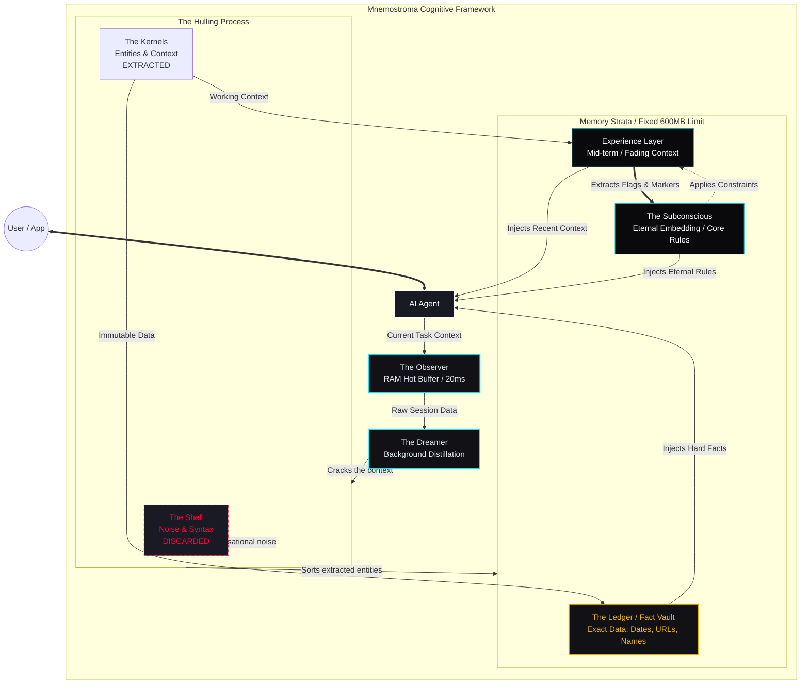

# Mnemostroma

### The memory layer for AI agents


> *μνήμη (mnḗmē, memory) + στρῶμα (strôma, layer) — the substrate everything rests on.*

> [!WARNING]
> **CRITICAL UPDATE NOTICE (v1.8.2 / v1.8.3)**
> Important patches have been released resolving severe daemon crash loops and zombie process accumulation. **All users must fully reinstall Mnemostroma and systemd services** via `pip install -e "."` and `mnemostroma service install` for system stability. Existing SQLite databases will act correctly. If your system crashed previously, execute `python3 scripts/clean-zombies.py` to fix memory state before starting.

---

You open a new chat. Explain everything again.
The model has no idea what you decided last week.
What's blocked. What's off the table. What matters.

You're not talking to an agent. You're talking to a goldfish with a PhD.

**Mnemostroma fixes that.**

It sits between you and your AI — silent, invisible, always on.
You keep working. Mnemostroma watches, learns, remembers.

Next session? Your agent already knows the context.
No prompting tricks. No pasting logs. No "as I mentioned before."

---

## What it does

Every time you work with an AI agent, Mnemostroma:

- **Catches what matters** — decisions, constraints, key facts — automatically
- **Compresses it smartly** — not a transcript, a distilled memory
- **Surfaces it when relevant** — without you asking
- **Forgets gracefully** — old stuff fades, critical stuff stays forever
- **Works offline** — your memory, your machine, no cloud

---

A dual-stream async pipeline (Observer + Content) backed by 5 memory layers and
a Formal Hexagonal Architecture — strictly decoupled via Ports and Repository Adapters
(SessionRepo, PrecisionRepo) over SQLite WAL. All in ~420MB RAM (baseline) / ~650MB (zoo), ~20ms retrieval.

---

## How it works

```
Your Agent
    │
    ├── OBSERVER (async sidecar — writes)
    │     Watches all I/O, extracts entities, embeds, scores, indexes
    │     Agent never writes memory — Observer does it silently
    │
    ├── AGENT TOOLS (read-only, via MCP)
    │     ctx_semantic()  → find by meaning          ~20ms
    │     ctx_anchors()   → decisions, deadlines    <0.1ms
    │     ctx_search()    → find by tags            <0.1ms
    │     ctx_bridge()    → session handoff packet  <0.01ms
    │
    └── CONTENT BRANCH (versioned artifacts)
          Code, chapters, configs — with diffs and why_changed
```

**The agent never writes memory.** It only reads and acts. Observer handles everything else.

---

### Architecture Diagram



---

**Example — memory retrieval in action:**

```
You:   "What did we decide about the auth flow last week?"
Agent: (silently calls ctx_semantic("auth flow decision"))
       "We decided to use short-lived JWT tokens with refresh via
        Redis — no sessions on the server side."
```

No prompting tricks. No copy-pasting logs. The agent just knows.
**Core product is RAM-only by default** for speed. Reliability is guaranteed by a formal `PersistenceLayer` (Phase 9.2), which manages asynchronous SQLite WAL writes and provides a strict isolation boundary between memory logic and storage.

---

## Memory model

Mnemostroma doesn't archive — it **dissolves**.

```
Day 1:    Full detail — brief, anchors, precision data, embedding
Week:     Detail fades — precision moves to SQLite
Month:    Brief + tags + anchors remain
Year:     Brief + embedding only
Decade:   Embedding only — the shape of memory without content
```

What you use stays vivid. What you don't fades gradually.
Principles never dissolve. Decisions persist. Phone numbers expire.

This is not a database with TTL. This is how human memory works.

---

## Status

**Current:** v1.8.2 | 2026-04-20

| Component                                | Status                           |
| ---------------------------------------- | -------------------------------- |
| Core backend (Observer, Memory, Storage) | DONE Implemented, 411/411 tests  |
| Anchor Layer / Emotional Patterns        | DONE Implemented                 |
| Implicit Feedback (v1.5)                 | DONE Implemented                 |
| PersistenceLayer Split (Phase 9.2)       | DONE Implemented (v1.7.1)        |
| CLI User Mode (setup/on/off/status)      | DONE Implemented (v1.7.1)        |
| MCP Server (stdio + SSE)                 | DONE Implemented                 |
| Continuation Detection & Mention Type    | DONE Implemented                 |
| Decay Engine & Dreamer                   | DONE Implemented (Stage C/D)     |
| Passthrough HTTPS Proxy (:8767)          | DONE Implemented (v1.7.5)        |
| `mnemo` launcher with proxy failsafe     | DONE Implemented (v1.7.5)        |
| Model install CLI                        | DONE Implemented                 |
| **Daemon auto-start scripts**            | DONE Linux (systemd), macOS, Win |
| **Hexagonal Storage Refactor**           | DONE Implemented (v1.8.0)        |

---

## Installation

**Requires Python 3.12+**

> WARNING Not yet on PyPI. Install directly from GitHub:

**Linux / macOS:**

```bash
pip install "git+https://github.com/GG-QandV/mnemostroma.git"

# With SSE extras (claude.ai + Claude Code passthrough proxy):
pip install "git+https://github.com/GG-QandV/mnemostroma.git[sse]"

# With system tray:
pip install "git+https://github.com/GG-QandV/mnemostroma.git[all]"
```

### Installation Extras

| Extra    | Installs              | Commands unlocked                          |
| -------- | --------------------- | ------------------------------------------ |
| *(base)* | Core daemon           | `setup` `on` `off` `status` `watch` `logs` |
| `[sse]`  | SSE adapter + proxy   | `sse`                                      |
| `[tray]` | System tray (pystray) | `tray`                                     |
| `[all]`  | Everything above      | All commands                               |

> **Note:** On Linux, `[tray]` also requires system libraries:
> `sudo apt install libgirepository1.0-dev gir1.2-appindicator3-0.1`

**Windows (PowerShell):**

```powershell
pip install "git+https://github.com/GG-QandV/mnemostroma.git"

# With SSE extras:
pip install "git+https://github.com/GG-QandV/mnemostroma.git[sse]"
```

> **Tip:** Use [pipx](https://pipx.pypa.io) for a cleaner global install that doesn't pollute your system Python:
> 
> ```bash
> pipx install "git+https://github.com/GG-QandV/mnemostroma.git"
> ```

---

## Quick Start

```bash
mnemostroma setup        # Create ~/.mnemostroma/, download models (~300 MB), generate TLS cert + mnemo launcher
mnemostroma on           # Start daemon in background
mnemostroma status       # Check health, RAM usage, session count
mnemostroma off          # Stop daemon
```

**With passthrough proxy (captures Claude Code sessions into memory):**

```bash
mnemostroma sse          # Start SSE adapter + proxy on :8767
mnemo                    # Launch Claude Code through the proxy (falls back to direct if proxy is down)
```

**Register as autostart service:**

| OS      | Command                       | Backend             |
| ------- | ----------------------------- | ------------------- |
| Linux   | `mnemostroma service install` | systemd user unit   |
| macOS   | `mnemostroma service install` | launchd LaunchAgent |
| Windows | `mnemostroma service install` | Task Scheduler      |

> **Windows note:** Signals `SIGUSR1/2` (flush/dump) are unavailable on Windows. Use `mnemostroma off` and `mnemostroma on` instead. For the best beta experience, WSL2 (Ubuntu) is recommended.

**Management commands:**

```bash
mnemostroma config list       # View all 80+ tunable parameters
mnemostroma logs --days 7     # Memory growth and calibration report
mnemostroma watch             # Live terminal dashboard
mnemostroma tray              # System tray indicator (requires [tray] extra)
```

**Emergency Operations (Crash/Zombie cleanup):**
If Mnemostroma terminals hang, multiple daemon instances collide, or RAM refuses to release after a bad upgrade/crash:
- **Via CLI:** Run `python3 scripts/clean-zombies.py` in the project root. It auto-locates your `venv`, gracefully stops systemd services, and aggressively hunts and kills all lingering processes from RAM without affecting your databases.
- **Via Tray:** Select **"Hard RAM Reset (Emergency)"** from the Mnemostroma Tray menu to execute this silently.
  
> **Note:** if `tray` command is missing or fails, ensure you installed the extra:
> `pip install "mnemostroma[tray]"`

> **Next step:** Set up daemon auto-start on your OS ([Linux](./scripts/linux/README.md) | [macOS](./scripts/macos/README.md) | [Windows](./scripts/windows/README.md)) — see [Daemon Installation Guide →](./scripts/README.md)

---

## Model Setup

Downloaded automatically during `mnemostroma setup` (~300 MB total):

| Model                        | Size    | Role                                |
| ---------------------------- | ------- | ----------------------------------- |
| `multilingual-e5-small` INT8 | ~117 MB | Session + content embedder (384d)   |
| `distilbert-ner` INT8        | ~60 MB  | Named entity recognition            |
| `tinybert-l2-v2` INT8        | ~7 MB   | Cross-encoder reranking (lazy load) |

---

## Stack

No torch. No transformers. No LangChain. No Docker. No Redis. No cloud.

| Component                  | Disk                               | Role                              |
| -------------------------- | ---------------------------------- | --------------------------------- |
| multilingual-e5-small INT8 | ~117 MB                            | Session & content embedder (384d) |
| distilbert-ner INT8        | ~60 MB                             | HybridNER                         |
| TinyBERT-L-2-v2 INT8       | ~7 MB                              | Reranker (lazy)                   |
| **Total working set**      | **~300 MB disk · ~420-750 MB RAM** |                                   |

Core dependencies: `onnxruntime, tokenizers, numpy, lz4, aiosqlite`

---

## API surface (12 tools via MCP)

**Recollection (8):**

- `ctx_full(id)`: Full-text version from SQLite (for exact quoting)
- `ctx_anchors(type)`: Subconscious anchors (decisions, facts, deadlines)
- `ctx_precision(type)`: Exact data (links, formulas, quotes)
- `ctx_bridge()`: Structured context handoff packet for next agent
- `content_search(query)`: Semantic search over artifacts (code, docs)
- `content_get(id, version)`: Metadata retrieval for artifact
- `content_raw(id, version)`: Full source retrieval (expensive)
- `content_history(id)`: Version lineage and change log

**Navigation (4):**

- `ctx_semantic(query)`: Meaning-based search (MatrixSearch ANN, ~20ms)
- `ctx_get(id)`: Retrieve specific session by ID
- `ctx_search(tags)`: Tag-based search (precise, multi-language)
- `ctx_recent(n)`: Temporally ordered recent sessions (Repo-backed)

> **Note:** `ctx_active` is removed — current context is injected via `<memorycontext>` in the system prompt automatically. `ctx_urgent` is merged into `ctx_anchors(type="deadline")`. `ctx_load` is daemon-internal only.

**Observer Principle:** You never call "save_memory". The Observer watches your conversation and handles everything in the background. Tools are for *reading* memory, not writing it.

---

## Connecting to LLM (MCP)

The daemon must be running before any client connects.

**Choose your OS for installation details:**

- [Linux (systemd)](./scripts/linux/README.md)
- [macOS (launchd)](./scripts/macos/README.md)
- [Windows (Task Scheduler)](./scripts/windows/README.md)

Or use the universal installer: `bash scripts/install-daemon.sh` (Linux/macOS)

### Starting the Daemon

The daemon is a background service that runs independently of any IDE or client. Set it up once per system, then forget about it.

**Linux — systemd user unit**

Use the provided installation script:

```bash
bash scripts/install-daemon.sh
```

→ **[Full Linux installation guide →](./scripts/linux/README.md)**

This installs three systemd user units from `scripts/`:

- `mnemostroma-daemon.service` — Main daemon (Observer + Memory + Storage)
- `mnemostroma-proxy.service` — HTTPS passthrough proxy (optional, for Claude Code)
- `mnemostroma-watchdog.service` — Health monitor

Quick commands:

```bash
systemctl --user status mnemostroma-daemon
systemctl --user start mnemostroma-daemon
systemctl --user stop mnemostroma-daemon
journalctl --user -u mnemostroma-daemon -f
```

**macOS — launchd LaunchAgent**

Use the provided installation script:

```bash
bash scripts/install-daemon.sh
```

→ **[Full macOS installation guide →](./scripts/macos/README.md)**

Or run directly:

```bash
bash scripts/macos/install.sh
```

Quick commands:

```bash
launchctl start com.mnemostroma.daemon
launchctl stop com.mnemostroma.daemon
tail -f ~/.mnemostroma/daemon.log
```

**Windows — Task Scheduler**

Use the provided PowerShell script (run as Administrator):

```powershell
Set-ExecutionPolicy -ExecutionPolicy RemoteSigned -Scope CurrentUser
.\scripts\windows\install-daemon.ps1
```

→ **[Full Windows installation guide →](./scripts/windows/README.md)**

Quick commands:

```powershell
Start-ScheduledTask -TaskName "Mnemostroma Daemon"
Stop-ScheduledTask -TaskName "Mnemostroma Daemon"
taskschd.msc
```

> **Architecture note:** Clients (VS Code, Claude Code, Cursor) will spawn lightweight adapter processes (~70 MB) that connect to this daemon via socket. The daemon persists; adapters are ephemeral.

---

### Claude Desktop

**`claude_desktop_config.json`** — same config on all platforms:

```json
{
  "mcpServers": {
    "mnemostroma": {
      "command": "mnemostroma",
      "args": ["mcp"]
    }
  }
}
```

> **Windows:** If `mnemostroma` is not in PATH, use the full path:
> `C:\Users\<YourName>\AppData\Local\Programs\Python\Python312\Scripts\mnemostroma.exe`

Config file locations:

- **Linux/macOS:** `~/.config/Claude/claude_desktop_config.json`
- **Windows:** `%APPDATA%\Claude\claude_desktop_config.json`

---

### Claude Code (CLI)

Claude Code uses the stdio adapter. Run `mnemostroma setup` first — it prints the ready-to-paste config.

**`~/.claude.json`** — `mcpServers` block:

**Linux / macOS:**

```json
{
  "mcpServers": {
    "mnemostroma": {
      "command": "/home/<yourname>/.local/bin/mnemostroma",
      "args": ["mcp"]
    }
  }
}
```

**Windows (PowerShell):**

```json
{
  "mcpServers": {
    "mnemostroma": {
      "command": "C:\\Users\\<YourName>\\AppData\\Local\\Programs\\Python\\Python312\\Scripts\\mnemostroma.exe",
      "args": ["mcp"]
    }
  }
}
```

> Find the correct path: `where mnemostroma` (Windows) / `which mnemostroma` (Linux/macOS)

---

### Claude Code — Passthrough Proxy (Observer for CLI sessions)

To capture Claude Code conversations into memory, run the SSE adapter with the passthrough proxy.
Requires `mnemostroma[sse]` and `mnemostroma setup` (generates TLS cert + wrapper script).

**Step 1 — Setup (once):**

```bash
pip install "mnemostroma[sse]"
mnemostroma setup   # generates TLS cert + ~/.local/bin/mnemo wrapper
```

**Step 2 — Start SSE adapter (includes proxy on :8767):**

```bash
mnemostroma sse
```

**Step 3 — Launch Claude Code via wrapper:**

**Linux / macOS:**

```bash
mnemo           # instead of 'claude' — sets proxy env vars automatically
```

> `mnemo` is a wrapper script placed in `~/.local/bin/` by `mnemostroma setup`.
> It sets `ANTHROPIC_BASE_URL` and `NODE_EXTRA_CA_CERTS` only for that process.
> If the proxy is not running, Claude Code works normally (direct API, no capture).

**Windows (PowerShell) — no wrapper, set manually:**

```powershell
$env:ANTHROPIC_BASE_URL = "https://localhost:8767"
$env:NODE_EXTRA_CA_CERTS = "$env:USERPROFILE\.mnemostroma\certs\passthrough-ca.pem"
claude
```

> The proxy forwards all traffic transparently to `api.anthropic.com`. It only intercepts `/v1/messages` responses to extract text and send it to the Observer. Your API key is never stored.

---

### IDEs (Cursor, Windsurf, Cline, Zed, Antigravity, Continue…)

All IDEs use the stdio adapter. Multiple IDEs can connect simultaneously — each spawns a ~5 MB adapter process sharing one daemon.

| IDE                 | Config file                    | Status                                                    |
| ------------------- | ------------------------------ | --------------------------------------------------------- |
| **VS Code Copilot** | `~/.config/Code/User/mcp.json` | DONE                                                      |
| **Claude Code**     | `~/.claude/mcp.json`           | DONE                                                      |
| **Antigravity**     | `mcp.json` (project root)      | DONE                                                      |
| **Continue**        | `~/.continue/config.yaml`      | FAILED `env` blocks not supported in v1.2.22 (limitation) |

> **Note on Continue (IDE):** As of v1.2.22, Continue does not support `env` blocks in MCP configurations. This prevents it from correctly using the `NODE_EXTRA_CA_CERTS` variable required for the Mnemostroma passthrough proxy. Use Claude Code or VS Code with standard stdio adapters for the full experience.

**Linux / macOS** — add to your IDE's MCP config:

```json
{
  "mcpServers": {
    "mnemostroma": {
      "command": "/path/to/venv/bin/python3",
      "args": ["-m", "mnemostroma.integration.mcp_stdio_adapter"]
    }
  }
}
```

**Windows** — add to your IDE's MCP config:

```json
{
  "mcpServers": {
    "mnemostroma": {
      "command": "C:\\path\\to\\venv\\Scripts\\python.exe",
      "args": ["-m", "mnemostroma.integration.mcp_stdio_adapter"]
    }
  }
}
```

> Find the path: `pip show mnemostroma` → `Location` → one level up to `bin/` (Linux/macOS) or `Scripts/` (Windows).

---

### claude.ai (SSE + browser extension)

Connect Mnemostroma to claude.ai web chat — tools available to Claude, conversations captured in real time.

→ **[Setup guide: docs/CLAUDE_AI_SETUP.md](docs/CLAUDE_AI_SETUP.md)**

---

## Logging

Mnemostroma writes local diagnostic logs to `logs.db` during beta.
**Logs never leave your machine.**

`~/.mnemostroma/config.json`:

```json
"logging": {
  "enabled": true,
  "mode": "safe"
}
```

`safe` mode keeps only event types and metadata — no message content.

---

## How it compares

|                      | Mnemostroma            | MemGPT/Letta      | Zep               | Mem0          |
| -------------------- | ---------------------- | ----------------- | ----------------- | ------------- |
| Architecture         | RAM-first sidecar      | LLM-managed pages | Server + Postgres | Cloud API     |
| Retrieval latency    | **~20ms**              | ~200ms            | ~100ms            | **1.44s p95** |
| RAM overhead         | ~600MB                 | ~2GB+             | ~1GB+             | Cloud         |
| Offline              | **Yes**                | Partial           | No                | No            |
| GPU required         | **No**                 | Yes               | No                | Cloud         |
| Framework dependency | **None**               | LangChain         | LangChain         | SDK           |
| Agent writes memory  | **No (Observer)**      | Yes               | Yes               | Yes           |
| Memory dissolution   | **Gradual (5 layers)** | Binary evict      | TTL               | TTL           |
| Content versioning   | **Yes (diffs)**        | No                | No                | No            |

---

## Philosophy

Memory isn't storage.
Memory is knowing what to remember, when, and how much detail.

Mnemostroma doesn't give your agent a bigger context window.
It gives your agent an actual memory.

---

## Development & Testing

```bash
git clone https://github.com/GG-QandV/mnemostroma.git
cd mnemostroma
pip install -e ".[dev]"
pytest tests/                          # run all 411 tests
pytest tests/ --ignore=tests/test_memory_layers.py \
              --ignore=tests/test_data_contracts.py  # fast mode (~14s)
```

---

## Contributing & Support

Found a bug? Have an idea?
→ **[Open an issue](https://github.com/GG-QandV/mnemostroma/issues/new/choose)**

Please include your OS, Python version, `mnemostroma status` output, and steps to reproduce.

**Maintenance cadence:** As a solo developer focused on deep work, I process Issues and PRs in weekly batches (usually on weekends). Expect a response within 7 days.

---

## License & Enterprise

**Mnemostroma Core is licensed under the FSL-1.1-MIT**.
Commercial restricted for 2 years (no SaaS competitors), then MIT.

**Mnemostroma Pro (Commercial)**
Cloud Sync, Subconscious Layer (personalized models), Shared Experience, and Team Context Import.

---

*Mnemostroma — the memory layer for AI agents*
*offline · ~420MB RAM (baseline) · ~20ms · 411 tests · v1.8.0*

# [mnemostroma-protocol]

## Memory Protocol (Mnemostroma)

Tools available via MCP. Agent decides usage. Continuity via injected <memorycontext>.
Agent may call ctx.semantic if needed — or reason from context alone.

# [mnemostroma-protocol]-end
